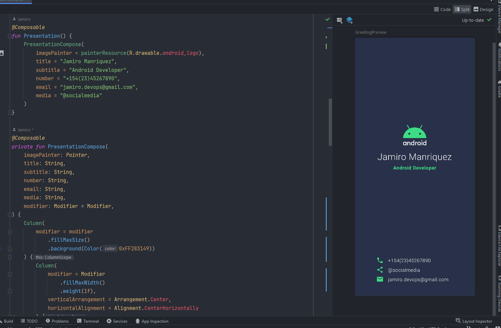

# My Android Development Progress

Este repositorio es parte de mi registro de progreso en el aprendizaje del desarrollo móvil. Compartiré proyectos y codelabs que estoy realizando mientras estudio el desarrollo de aplicaciones Android.

## Proyecto: Presentación Personal

En este proyecto, he creado una presentación personal utilizando Jetpack Compose y Kotlin. La presentación muestra una imagen, nombre, profesión y detalles de contacto.

## Características

- Visualización de una imagen personal o de marca.
- Nombre y profesión destacados.
- Números de contacto, redes sociales y correo electrónico.

## Tecnologías utilizadas

- Jetpack Compose
- Kotlin

## Cómo ejecutar el proyecto

1. Clona el repositorio: `git clone`
2. Abre el proyecto en Android Studio.
3. Ejecuta la aplicación en un emulador o dispositivo Android.

¡Disfruta explorando mi presentación personal!

---

_¡Este proyecto es parte de mi viaje de aprendizaje en el desarrollo de aplicaciones móviles!_

**Autor:** Jamiro Manriquez 

**Email:** jamiro.devops@gmail.com
